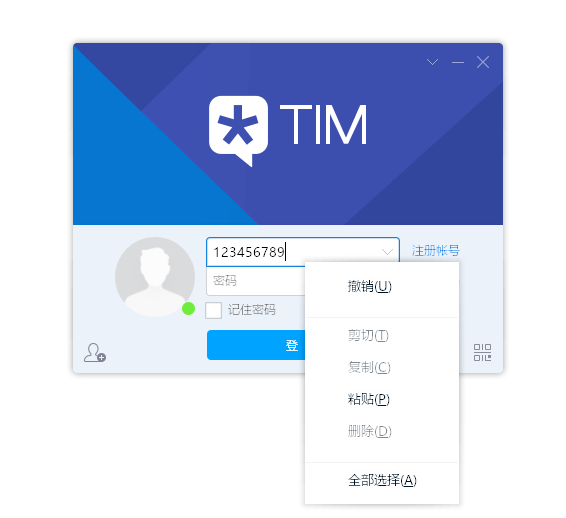
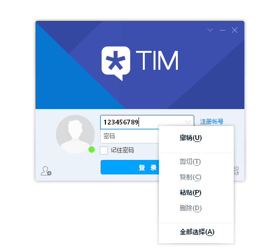
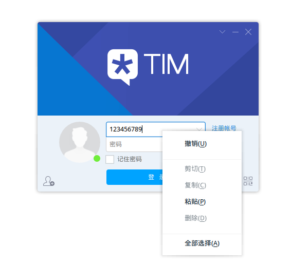

在Archlinux及衍生发行版上运行TIM
=======

<p align="center">
  <a href="https://travis-ci.org/countstarlight/deepin-wine-tim-arch">
    
  </a>
  <a href="https://office.qq.com/download.html">
    
  </a>
  <a href="https://aur.archlinux.org/packages/deepin-wine-tim/">
    
  </a>
  <a href="https://github.com/countstarlight/deepin-wine-tim-arch/releases">
    
  </a>
  <a href="https://github.com/countstarlight/deepin-wine-tim-arch/issues">
    
  </a>
</p>

Deepin 打包的 TIM 容器移植到 Archlinux，不依赖 `deepin-wine`，包含定制的注册表配置，TIM 安装包替换为官方最新

<!-- TOC -->

- [安装](#安装)
    - [从AUR安装](#从aur安装)
    - [用安装包安装](#用安装包安装)
    - [本地打包安装](#本地打包安装)
- [切换到 `deepin-wine`](#切换到-deepin-wine)
- [字体](#字体)
    - [使用其他字体](#使用其他字体)
    - [修复字体模糊](#修复字体模糊)
- [常见问题](#常见问题)
- [感谢](#感谢)
- [更新日志](#更新日志)

<!-- /TOC -->

## 安装

`deepin-wine-tim` 依赖`Multilib`仓库中的 `wine`，`wine_gecko` 和 `wine-mono`，Archlinux 默认没有开启` Multilib`仓库，需要编辑`/etc/pacman.conf`，取消对应行前面的注释([Archlinux wiki](https://wiki.archlinux.org/index.php/Official_repositories#multilib)):

```diff
# If you want to run 32 bit applications on your x86_64 system,
# enable the multilib repositories as required here.

#[multilib-testing]
#Include = /etc/pacman.d/mirrorlist

-#[multilib]
-#Include = /etc/pacman.d/mirrorlist
+[multilib]
+Include = /etc/pacman.d/mirrorlist
```

### 从AUR安装

已添加到 AUR [deepin-wine-tim](https://aur.archlinux.org/packages/deepin-wine-tim/)，使用 `yay` 安装（如未安装 `yay`，请先 `pacman -S yay` 进行安装）：

```shell
yay -S deepin-wine-tim
```

### 用安装包安装

> 由 [Travis CI](https://travis-ci.org/countstarlight/deepin-wine-tim-arch) 在 Docker 容器 [mikkeloscar/arch-travis](https://hub.docker.com/r/mikkeloscar/arch-travis) 中自动构建的 ArchLinux 安装包

在[GitHub Release](https://github.com/countstarlight/deepin-wine-tim-arch/releases)页面下载 `.pkg.tar.xz`后缀的安装包，使用`pacman`安装：

```bash
sudo pacman -U #下载的包名
```

### 本地打包安装

```shell
 git clone https://github.com/countstarlight/deepin-wine-tim-arch.git

 cd deepin-wine-tim-arch
  
 makepkg -si
```

* 运行应用菜单中创建的 TIM 快捷方式，开始安装 TIM

* 安装完可直接启动

## 切换到 `deepin-wine`

由于原版 `wine` 在DDE(Deepin Desktop Environment)上，存在托盘图标无法响应鼠标事件([deepin-wine-tim-arch#21](https://github.com/countstarlight/deepin-wine-tim-arch/issues/21))等问题，且原版 `wine` 尚不能实现保存登录密码等功能，可以选择切换到 `deepin-wine`。

根据 [deepin-wine-tim-arch#15](https://github.com/countstarlight/deepin-wine-wechat-arch/issues/15#issuecomment-515455845)，由 [@feileb](https://github.com/feileb) 和 [@violetbobo](https://github.com/violetbobo) 提供的方法：

* 1. 安装 deepin-wine

```bash
yay -S deepin-wine
```

* 2. 修改 `deepin-wine-tim` 的启动文件

/opt/deepinwine/tools/run.sh

/opt/deepinwine/apps/Deepin-TIM/run.sh

修改这两个文件中的 `WINE_CMD` 的值：

```diff
-WINE_CMD="wine"
+WINE_CMD="deepin-wine"
```

**注意：对 `/opt/deepinwine/apps/Deepin-TIM/run.sh` 的修改会在 `deepin-wine-tim` 更新或重装时被覆盖，可以单独拷贝一份作为启动脚本**

* 3. 修复 `deepin-wine` 字体渲染发虚

```bash
yay -S lib32-freetype2-infinality-ultimate
```

**注意：切换到 `deepin-wine` 后，对 `wine` 的修改，如更改dpi，都改为对 `deepin-wine` 的修改**

## 字体

### 使用其他字体

默认使用文泉驿微米黑（`wqy-microhei`）字体，目前有字体虚化、模糊问题，可使用 Windows 平台常用字体替代，直接将字体文件或字体链接文件放置到字体目录即生效，不影响系统字体。

TIM 字体所在目录：`$HOME/.deepinwine/Deepin-TIM/drive_c/windows/Fonts`

Windows 10 自带字体及版本：<https://docs.microsoft.com/en-us/typography/fonts/windows_10_font_list>

* 中易宋体（`SimSun`）：`simsun.ttf` 或 `simsun.ttc`：

  
  
  上图为 `SimSun Regular`

* 微软雅黑（`Microsoft YaHei`）：`msyh.ttf` 或 `msyh.ttc`：

  
  
  上图为 `Microsoft YaHei Regular`

  
  
  上图为 `Microsoft YaHei Bold`

* （繁体）细明体（`MingLiU`）：`mingliu.ttf` 或 `mingliu.ttc`
* （繁体）新细明体（`PMingLiU`）：`pmingliu.ttf` 或 `pmingliu.ttc`

### 修复字体模糊

上述微软雅黑字体仍然比较模糊，参照 [@ohmyarch的博客](https://ohmyarch.github.io/2017/01/15/Linux%E4%B8%8B%E7%BB%88%E6%9E%81%E5%AD%97%E4%BD%93%E9%85%8D%E7%BD%AE%E6%96%B9%E6%A1%88/)配置后的微软雅黑效果较好：



**注意：这会修改整个系统的字体配置，且配置后的宋体（`SimSun`）等字体效果不如之前**

## 常见问题

- [ ] 1. 不能视频通话
- [ ] 2. 不能记住密码
- [ ] 3. 网络连接状态改变后不能重连: [issue19](https://github.com/countstarlight/deepin-wine-tim-arch/issues/19)
- [x] 4. 在 2k/4k 屏幕下字体和图标都非常小, 参见 [issue1](https://github.com/countstarlight/deepin-wine-tim-arch/issues/1)
- [x] 5. 使用全局截图快捷键和解决Gnome上窗口化问题，参见 [issue2](https://github.com/countstarlight/deepin-wine-tim-arch/issues/2)

## 感谢

* [Wuhan Deepin Technology Co.,Ltd.](http://www.deepin.org/)

* [@wszqkzqk](https://github.com/wszqkzqk) 的 [wszqkzqk-deepin-wine-tim-arch](https://github.com/wszqkzqk/wszqkzqk-deepin-wine-tim-arch)

* [@ssfdust](https://github.com/ssfdust) 的 [wszqkzqk-deepin-wine-tim-arch](https://github.com/ssfdust/wszqkzqk-deepin-wine-tim-arch)

## 更新日志

* 2019-09-21 TIM-2.3.2.21173
* 2019-03-06 TIM-2.3.2.21158
* 2019-02-05 TIM-2.3.1_3
* 2018-02-23 TIM-2.1.5
* 2017-12-23 TIM-2.1.0
* 2017-11-28 修复音频功能（麦克风录音和播放语音消息）
* 2017-11-21 TIM-2.0.0
